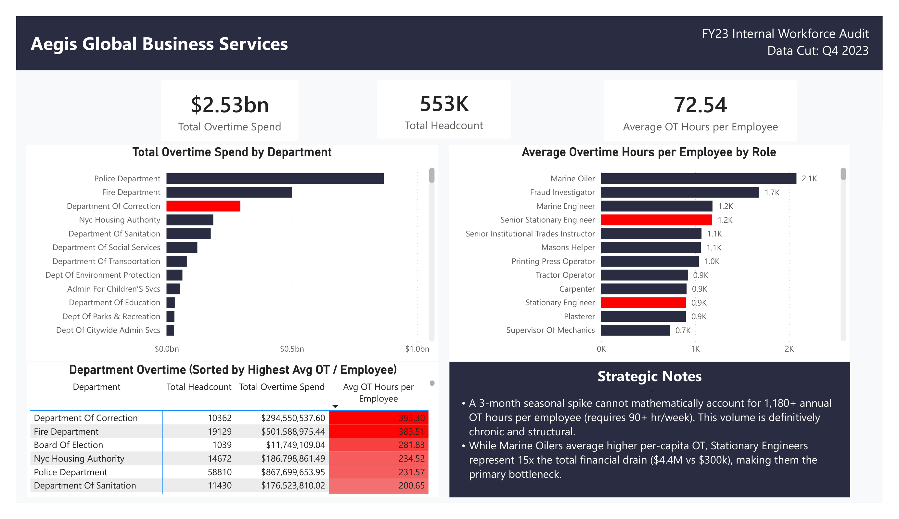

# Aegis GBS: Workforce Capacity & Overtime Optimizer

> **FY23 Internal Workforce Audit** | Python · SQL · Power BI

👉 📄 **[View Data Quality & SQL Insights Audit](Data_Audit.md)**

## 1. Executive Summary
Aegis GBS was losing **$2.53 billion annually** in overtime costs with no corresponding increase in operational throughput — a clear signal of structural waste, not volume growth. I analyzed 550,000+ legacy HRIS records to arbitrate 
a live executive dispute: the HR Director's seasonal spike theory versus the COO's structural understaffing hypothesis. The analysis proved the HR Director wrong with math, identified the exact roles and departments driving the bleed, and delivered a **cost-neutral restructuring plan that requires zero new budget from Finance.**

## 2. The Business Questions
1. Are we overspending due to brief, unexpected seasonal volume spikes — or do we have chronic, structural understaffing that we are masking with premium overtime pay?
2. If it is structural understaffing: which specific roles and departments are carrying disproportionate load, and what would right-sizing actually cost versus what the current overtime premium is costing us?
3. Can we fund this restructuring without requesting additional net-new budget — and if so, how do we make that case to Finance?

## 3. Data Architecture
Extracted 550,000+ raw payroll records from a legacy HRIS system with heavy entity fragmentation, mixed data types, and impossible OT values. Engineered a Python (Pandas) cleaning pipeline to resolve department naming inconsistencies via regex mapping, standardize financial columns, and quarantine outlier OT hours above a 3,120-hour annual hard cap (representing a sustained 60-hr workweek). The cleaned output was modeled as a single `payroll_fact` table (grain: one row per employee-year) in a SQLite data warehouse, then connected to Power BI to form the semantic layer for executive reporting.

`raw_payroll (HRIS extract)` → `Python cleaning pipeline` → `payroll_fact (SQLite)` → `Power BI semantic layer` → `Executive dashboard` 

**Source:** [NYC Open Data — Citywide Payroll Data, Fiscal Year 2023](https://data.cityofnewyork.us/City-Government/Citywide-Payroll-Data-Fiscal-Year-/k397-673e/data_preview)

## 4. Insights Deep-Dive
**Finding 1: The seasonal spike theory is mathematically impossible.** Senior Stationary Engineers averaged **1,180+ overtime hours per year** — equivalent to a sustained 65-hour workweek. A 3-month seasonal spike would require 90+ hour weeks to produce this volume. The data doesn't support a busy season; it describes a permanently overwhelmed team.

**Finding 2: The Department of Correction is the primary anomaly.** With the 6th-lowest headcount among top OT spenders, the Correction Department ranked 3rd in total overtime spend at **$294M+**. This ratio — high spend, lower headcount — is the fingerprint of localized structural understaffing, not company-wide seasonal pressure.

**Finding 3: The OT premium already funds the fix.** The overtime premium paid to Stationary Engineers alone totals **$4.4M annually** — enough to hire 15 full-time engineers at standard base salary. The company is already spending the money. It's just going to the wrong line item. *Salary benchmark derived from NYC civil service pay schedules; a ±15% variance in the base rate assumption shifts the FTE equivalent between 13–17 hires — not enough to change the recommendation.*

**Finding 4: The Police and Fire departments' spend is proportional — Correction's is not.** Police ($867M) and Fire ($501M) collectively account for over $1.3B in total OT spend, but their volume scales with headcount — an expected function of operational size. The Department of Correction was flagged precisely because its per-capita OT ratio is anomalous *relative to its size*: high spend, lower headcount, no proportional justification. That asymmetry is the signal. Targeting the biggest absolute spenders would have led to the wrong intervention.

> **Dataset Limitations:** Source is an annual FY23 snapshot; month-level
> timestamps and departure dates are unavailable in this extract.
> Time-series trending and turnover analysis are out of scope.
> The structural vs. seasonal conclusion rests on the mathematical
> impossibility argument above. The hidden cost of attrition driven
> by sustained 65-hour workweeks, including replacement hiring and
> knowledge loss, is flagged as a future scope item pending access
> to employee termination records.

## 5. Operational Recommendations

| Priority | Finding | Action | Implementation Risk |
|:---|:---|:---|:---|
| **Directional** | Correction Dept. OT ratio is anomalous — more spend than departments with significantly higher headcounts. | Stop looking for company-wide cuts. Audit resource allocation and shift scheduling specifically within the Correction Dept. | Requires shift scheduling data not available in the current extract; audit scope to be defined by operations leadership. |
| **Short-Term** | Senior Stationary Engineers averaging 1,180+ OT hours/year indicates severe burnout risk in a skilled, hard-to-replace cohort. | Open 5–10 job requisitions for Senior Stationary Engineers immediately. | Specialized roles carry 60–90 day hiring cycles; contract or staggered shift coverage is recommended to bridge the gap during recruitment. |
| **Strategic** | The $4.4M OT premium for Stationary Engineers exceeds the cost of 15 permanent FTE salaries. | Reallocate from the overtime budget to base salaries. Right-size the facilities team at zero net-new cost to Finance. | Phased budget reallocation across 2 fiscal quarters is recommended to avoid operational gaps during the transition period. |

---

**Tech Stack:** Python (Pandas) · SQL (SQLite) · Power BI · DAX